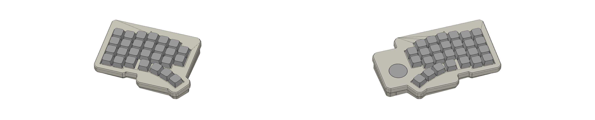
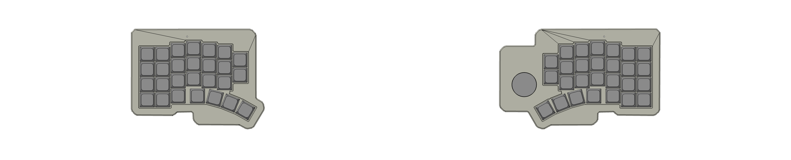

# split-ergo40pct-tp

A 54-key split ergonomic keyboard with integrated trackpad, powered by ZMK firmware.

## Overview

This is a wireless split keyboard featuring:

- **54 keys** in an ergonomic columnar stagger layout
- **Integrated trackpad** (Azoteq 　 IQS7211E Touch sensor) on the right half
- **Wireless connectivity** via Bluetooth Low Energy
- **ZMK firmware** with advanced features like layers, combos, and pointing device support
- **nRF52840-based controllers** (AKDK_BT1 compatible)

Generated by [Auto-Keyboard-Design-Kit](https://auto-kdk.pages.dev/)

## Preview

### 3D View



### Top View



## Hardware Requirements

### Parts List

| Part                                    | Quantity | Notes                           |
| --------------------------------------- | -------- | ------------------------------- |
| nRF52840 wireless controller (AKDK_BT1) | 2        | One for each half               |
| Conthrough(2.5mm, 9pin)                 | 4        | For controller connection       |
| LiPo Battery (3.7V)                     | 2        | Recommended:                    |
| USB-C cable                             | 1        | For charging and initial setup  |
| Choc V2 switch and socket               | 54       | Low-profile mechanical switches |
| 1N4148 Diode                            | 54       | Through-hole or SMD             |
| Choc V2 compatible keycaps              | 54       | 1u keycaps                      |
| Azoteq IQS7211E touch sensor            | 1        | Integrated on right half PCB    |

### PCB Features

- **Split design** with 27 keys per half
- **Columnar stagger** for ergonomic typing
- **Trackball integration** on right half
- **USB-C charging** ports on both halves
- **Battery management** circuitry

## Firmware Setup

### Prerequisites

- [West build tool](https://docs.zephyrproject.org/latest/develop/west/index.html)
- [ZMK development environment](https://zmk.dev/docs/development/setup)

### Building Firmware

1. **Clone this repository:**

   ```bash
   git clone <repository-url>
   cd split-ergo40pct-alpha
   ```

2. **Initialize west workspace:**

   ```bash
   west init -l config
   west update
   ```

3. **Build firmware:**

   ```bash
   # For left half
   west build -p -b akdk_bt1 -- -DSHIELD=split_ergo40pct_left -DCONFIG_ZMK_STUDIO=y

   # For right half (with trackball)
   west build -p -b akdk_bt1 -- -DSHIELD=split_ergo40pct_right -DCONFIG_ZMK_STUDIO=y
   ```

4. **Flash firmware:**
   - Put controller in bootloader mode
   - Copy `.uf2` files from `build/zephyr/` to the mounted drive

### Dependencies

This firmware uses the following ZMK modules:

- **zmk-pointing-acceleration-alpha**: Advanced pointer acceleration
- **zmk-driver-paw3222-alpha**: PAW3222 trackball sensor driver

## Keymap Configuration

### Default Layers

| Layer | Name      | Description                          |
| ----- | --------- | ------------------------------------ |
| 0     | Base      | QWERTY layout with modifiers         |
| 1     | Numbers   | Number row and navigation            |
| 2     | Function  | F-keys and system controls           |
| 3     | Bluetooth | BT pairing and numpad                |
| 4     | Mouse     | Mouse buttons and trackball controls |

### Trackball Features

#### Modes

- **Normal mode**: Standard cursor movement
- **Acceleration**: Dynamic sensitivity based on movement speed

### Customization

Edit `config/keymap.keymap` to customize:

- Key bindings
- Layer assignments
- Combo definitions

## Build Guide

For detailed assembly instructions, see:
[split-ergo40pct-alpha manual](https://github.com/nuovotaka/split-ergo40pct-alpha/wiki/Production_Instructions)

### Quick Assembly Steps

1. **Solder diodes** to PCB (mind polarity)
2. **Install switches** in sockets
3. **Mount controllers** using conthrough pins
4. **Connect batteries** to JST connectors
5. **Flash firmware** to both halves
6. **Pair halves** via Bluetooth
7. **Install keycaps** and test all keys
8. **Calibrate trackball** if needed

## Troubleshooting

### Common Issues

**Split halves not connecting:**

- Re-flash both halves
- Clear Bluetooth bonds: Hold reset combo
- Check battery levels

**Keys not registering:**

- Verify diode orientation
- Check switch socket connections
- Test with multimeter

### Configuration Files

- `config/keymap.keymap`: Main keymap configuration
- `boards/shields/split_ergo40pct/`: Hardware definitions
- `boards/arm/akdk_bt1/`: Controller board definition
- `build.yaml`: Build configuration

## Contributing

When modifying this firmware:

1. Test on actual hardware
2. Update documentation for any changes
3. Follow ZMK coding standards
4. Consider backward compatibility

## License

This project follows the ZMK license terms. Hardware designs may have separate licensing.

## Documentation

### Detailed Guides

- **[Build Guide](Doc/BUILD_GUIDE.md)**: Complete setup and build instructions
- **[Keymap Guide](Doc/KEYMAP.md)**: Layer configuration and customization

### Quick Links

- **Hardware Assembly**: See [Build Guide](Doc/BUILD_GUIDE.md#hardware-assembly)
- **Firmware Flashing**: See [Build Guide](Doc/BUILD_GUIDE.md#flashing-firmware)
- **Keymap Customization**: See [Keymap Guide](Doc/KEYMAP.md#customization-guide)

## Support

- **ZMK Documentation**: https://zmk.dev/docs
- **Hardware Issues**: Check PCB design files and [Build Guide](Doc/BUILD_GUIDE.md)
- **Firmware Issues**: Review ZMK logs via USB serial and [troubleshooting guides](Doc/BUILD_GUIDE.md#troubleshooting)

## Keymap Reference


_Note: This image shows the default layer. Additional layers provide numbers, functions, and trackball controls._
